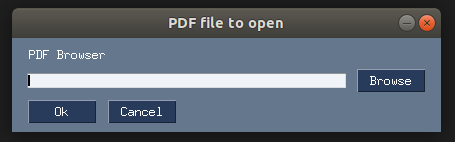
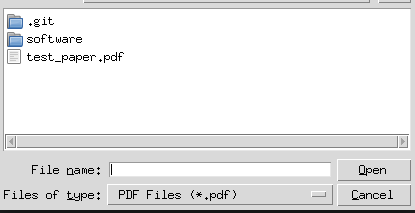
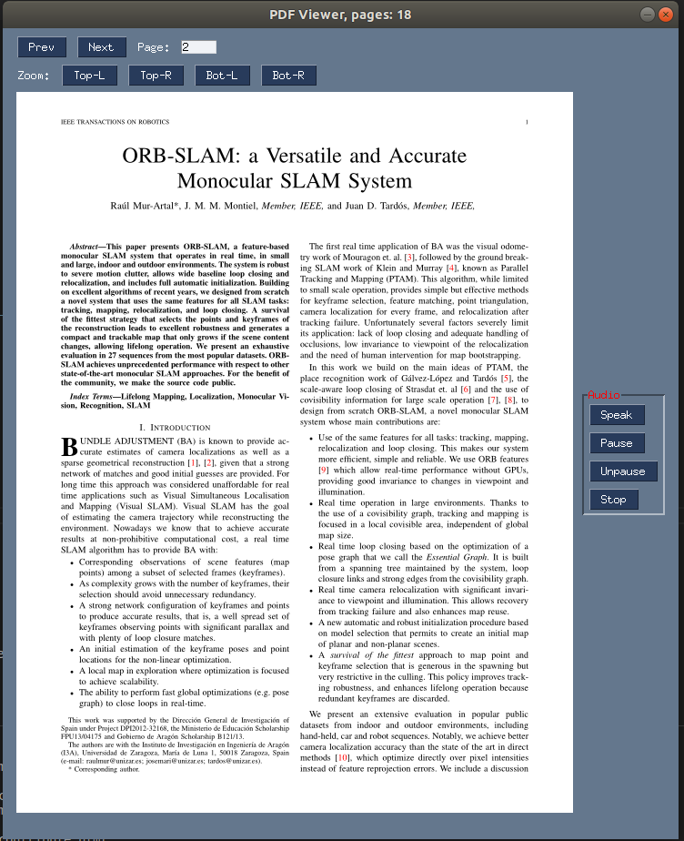

# AudioPaper

Tired of reading a lot of papers ? Just Relax and Listen to it.

## Requirements

* Clone the repository:

```
git clone https://github.com/Vinohith/AudioPaper.git
```

* Move into the cloned directory:

```
cd AudioPaper
```

* Create the environment from the `environment.yml` file:

```
conda env create -f environment.yml
```

## Usage

* In terminal run:

`python main.py`

## User Interface

* Select the PDF file:



* File manager to search for the file:



* PDF viewer and user interface:




## Additional Notes

Paper used for testing is [ORB-SLAM](https://arxiv.org/abs/1502.00956)
